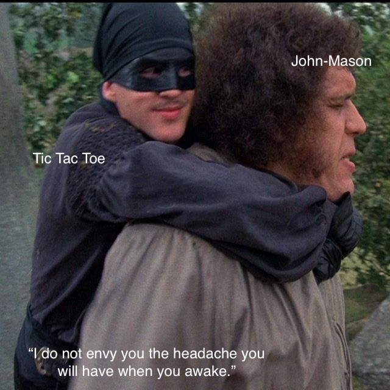

# Project Summary

## 1. The Plan

### 1.1 Assignment

See the original assignment in `doc/assignment.md`.

### 1.2 Approach (General Principles)

The project is a timed technical assessment (3 hours) to build a tic-tac-toe
game. The time will be divided into six 30-minute chunks:

- The first chunk is for setup and laying foundations.
- The last chunk is for polish and final review.
- The four middle chunks are for building features.

The approach emphasizes:

**Development Strategy:**

- Starting with a simple, CLI-based or minimal interface (e.g., "mental
  tic-tac-toe" using A1, B2, etc.), then iterating.
- Getting something playable as quickly as possible to reduce risk.
- Building design docs for advanced features like voice input, React UI,
  Real-time multiplayer, different AIs, etc. and running them in parallel,
  including whatever gets finished before the deadline.

**Risk Management:**

- Avoiding getting stuck ("tarpits") that could waste time.
- Using checkpoints every 30 minutes to stay on track.
- Forego fun projects that would take a couple of days rather than a few
  hours: iOS + Apple TV voice activated play, raspberry pi touch screen, etc.

**Assessment Focus:**

- Balancing demonstrating engineering knowledge & disciplines with need for
  speed and productivity.

**Project Setup & Foundation:**

- Using a monorepo setup (with pnpm or npm), and a template project for quick
  start.
- Using the latest LTS Node, vtest for testing.
- Keeping the model logic separate from display/UI logic for flexibility and
  reuse.

### 1.3 Milestone Plan

<!-- markdownlint-disable MD033 -->
<!-- use br tags in the table to separate lines in the plan column -->

| Milestone      | Plan                                                                                                                                                                                                                                                                                        |
| -------------- | ------------------------------------------------------------------------------------------------------------------------------------------------------------------------------------------------------------------------------------------------------------------------------------------- |
| M1 0:00 - 0:30 | • Outline approach, get lib project started<br>• Set up monorepo with pnpm/npm template<br>• Initialize project structure and tooling (Node LTS, vtest)<br>• Create lib directory for model classes<br>• Design core model architecture (game board, state, players, turn history)          |
| M2 0:30 - 1:00 | • Complete lib and first command-line<br>• Implement core tic-tac-toe model classes<br>• Build simple CLI interface using A1, B2 notation ("mental tic-tac-toe")<br>• Add basic game engine (win detection, move validation)<br>• Get something playable working                            |
| M3 1:00 - 1:30 | Build out designs and code for new features in parallel and see what lands<br>Focus on advanced features like voice input, React UI, real-time multiplayer, different AIs<br>Run multiple design docs and implementations in parallel<br>Include whatever gets finished before the deadline |
| M4 1:30 - 2:00 | ditto                                                                                                                                                                                                                                                                                       |
| M5 2:00 - 2:30 | ditto                                                                                                                                                                                                                                                                                       |
| M6 2:30 - 3:00 | Final polish<br>Ensure something demo-worthy is completed.                                                                                                                                                                                                                                  |

<!-- markdownlint-enable MD033 -->

M3-M5 were planned as parallel development of multiple advanced features, with
the understanding that not everything would be completed but whatever finished
would be included. This strategy (c.f. Toyota product development system)
maximizes the chance of having impressive features to show while managing the
time constraint.

## 2. What Actually Happened

### 2.1 Recap

<!-- markdownlint-disable MD033 -->
<!-- use br tags in the table to separate lines in the plan column -->

| Milestone      | Actual                                                                                                                                                                                                                                                                                                                                                                  |
| -------------- | ----------------------------------------------------------------------------------------------------------------------------------------------------------------------------------------------------------------------------------------------------------------------------------------------------------------------------------------------------------------------- |
| M1 0:00 - 0:30 | • Set up project structure and monorepo<br>• Created GitHub repository using pnpm template<br>• Started design document for core tic-tac-toe model<br>• Planned model architecture (game board, state, players, turn history)<br>• Set up testing infrastructure with vtest<br>• Initialized project with basic workflows and tooling                                   |
| M2 0:30 - 1:00 | • Continued working on design document<br>• Set up background agent to implement core model classes<br>• Created comprehensive design doc with detailed class specifications<br>• Started implementation of game engine, board, players, and move analyzer<br>• Set up GitHub Actions and testing infrastructure<br>• Began parallel development of CLI design document |
| M3 1:00 - 1:30 | • Background agent continued implementing core model classes<br>• Created CLI design document with Oclif framework<br>• Planned CLI milestones (basic game, match system, visual display)<br>• Started React component design document<br>• Began Fastify server design document<br>• Set up multiple parallel development tracks                                       |
| M4 1:30 - 2:00 | • Continued with background agent implementation<br>• Worked on fixing type errors and test issues<br>• Merged initial implementation with 152 passing tests<br>• Started CLI implementation using Oclif generator<br>• Created React component design with detailed specifications<br>• Began addressing review feedback and code quality issues                       |
| M5 2:00 - 2:30 | • Focused on getting CLI implementation working<br>• Used Oclif generator for rapid CLI development<br>• Worked on fixing remaining type errors and test issues<br>• Attempted to get playable game working before deadline<br>• Continued parallel development of React and server components<br>• Struggled with time management and scope creep                      |
| M6 2:30 - 3:00 | • Final push to get playable tic-tac-toe game working<br>• Used Oclif generator to quickly create CLI interface<br>• Demonstrated basic playable AI tic-tac-toe game<br>• Completed retrospective analysis of approach<br>• Identified issues with design document approach for short timeline<br>• Concluded with working but minimal implementation                   |

<!-- markdownlint-enable MD033 -->

### 2.2 Video Chapters

#### Milestone 1: Foundation (0:00-0:30)

| Timestamp | Title - Description                                                                                                                                                                                                                                                                                                                                                                                                                                                    |
| --------- | ---------------------------------------------------------------------------------------------------------------------------------------------------------------------------------------------------------------------------------------------------------------------------------------------------------------------------------------------------------------------------------------------------------------------------------------------------------------------- |
| 0:00:00   | [Project Introduction](https://www.loom.com/share/de1851b74e94415c92fb426a97583fb0?sid=f53302bb-bfc8-4904-a48b-15904486e049?t=0) - Strategic time division into 6 milestones                                                                                                                                                                                                                                                                                           |
| 0:02:00   | [Design Doc Creation](https://www.loom.com/share/de1851b74e94415c92fb426a97583fb0?sid=f53302bb-bfc8-4904-a48b-15904486e049?t=120) for `packages/lib` - Llmzy voice recording [0:02:00](https://www.loom.com/share/de1851b74e94415c92fb426a97583fb0?sid=f53302bb-bfc8-4904-a48b-15904486e049?t=120), agent generates `doc/t3-lib-component.md` [0:10:59](https://www.loom.com/share/de1851b74e94415c92fb426a97583fb0?sid=f53302bb-bfc8-4904-a48b-15904486e049?t=10m59s) |
| 0:13:00   | [Project Approach Discussion](https://www.loom.com/share/de1851b74e94415c92fb426a97583fb0?sid=f53302bb-bfc8-4904-a48b-15904486e049?t=780) - `doc/approach.md` mental tic-tac-toe concept                                                                                                                                                                                                                                                                               |
| 0:29:45   | [Repository Creation](https://www.loom.com/share/de1851b74e94415c92fb426a97583fb0?sid=f53302bb-bfc8-4904-a48b-15904486e049?t=29m45s) - `jpshack-at-palomar/pnpm-template` → `all-hands-t3`                                                                                                                                                                                                                                                                             |

#### Milestone 2: `lib` Component (0:30-1:00)

| Timestamp | Title - Description                                                                                                                                                                                                                                                                                                                                   |
| --------- | ----------------------------------------------------------------------------------------------------------------------------------------------------------------------------------------------------------------------------------------------------------------------------------------------------------------------------------------------------- |
| 0:33:35   | [Project Structure Ready](https://www.loom.com/share/de1851b74e94415c92fb426a97583fb0?sid=f53302bb-bfc8-4904-a48b-15904486e049?t=33m35s) - "Great, test ran" - comprehensive pnpm workspace with TypeScript, Vitest, ESLint all working                                                                                                               |
| 0:37:08   | [Design Document Completion](https://www.loom.com/share/de1851b74e94415c92fb426a97583fb0?sid=f53302bb-bfc8-4904-a48b-15904486e049?t=37m8s) - Finishing `lib` component design doc addressing missing content                                                                                                                                          |
| 0:45:00   | [Design Review](https://www.loom.com/share/de1851b74e94415c92fb426a97583fb0?sid=f53302bb-bfc8-4904-a48b-15904486e049?t=45m0s) - Wrapping up design doc, preparing for agent handoff                                                                                                                                                                   |
| 0:52:05   | [Kicking off Agent for `packages/lib`](https://www.loom.com/share/de1851b74e94415c92fb426a97583fb0?sid=f53302bb-bfc8-4904-a48b-15904486e049?t=52m5s)                                                                                                                                                                                                  |
| 0:55:00   | [GitHub Integration Setup](https://www.loom.com/share/de1851b74e94415c92fb426a97583fb0?sid=f53302bb-bfc8-4904-a48b-15904486e049?t=55m0s) - Fixing GitHub Actions while agent works                                                                                                                                                                    |
| 0:57:00   | [Commits rolling in](https://www.loom.com/share/de1851b74e94415c92fb426a97583fb0?sid=f53302bb-bfc8-4904-a48b-15904486e049?t=57m0s) - [`lib` game library commits begin to land](https://www.loom.com/share/de1851b74e94415c92fb426a97583fb0?sid=f53302bb-bfc8-4904-a48b-15904486e049?t=57m0s): board, state management, players, engine, action space |

#### **Milestone 3: Enhanced Interface (1:00-1:30)**

| Timestamp | Title - Description                                                                                                                                                                                                       |
| --------- | ------------------------------------------------------------------------------------------------------------------------------------------------------------------------------------------------------------------------- |
| 1:03:16   | [Placeholders for React and Fastify components](https://www.loom.com/share/de1851b74e94415c92fb426a97583fb0?sid=f53302bb-bfc8-4904-a48b-15904486e049?t=1m316s) - Starting parallel design track creation                  |
| 1:06:51   | [Start on `cli` Design Doc](https://www.loom.com/share/de1851b74e94415c92fb426a97583fb0?sid=f53302bb-bfc8-4904-a48b-15904486e049?t=1m651s) - Voice recording for Oclif-based CLI specifications with T3 command structure |
| 1:28:51   | [Review `lib` implementation](https://www.loom.com/share/de1851b74e94415c92fb426a97583fb0?sid=f53302bb-bfc8-4904-a48b-15904486e049?t=1m2851s) - Discovery that agent has been skipping test steps at milestone boundaries |

The milestone ended with the discovery of significant type errors in the agent's
work, setting up challenges for M4. This highlighted the tension between speed
(parallel development) and quality (proper testing and validation) that would
continue throughout the remaining milestones.

M3 was fundamentally about scaling up the development approach - moving from
sequential, careful implementation to ambitious parallel development of multiple
interfaces and features.

#### **Milestone 4: Polish & Documentation (1:30-2:00)**

| Timestamp | Title - Description                                                                                                                                                                                                                                                               |
| --------- | --------------------------------------------------------------------------------------------------------------------------------------------------------------------------------------------------------------------------------------------------------------------------------- |
| 1:28:17   | [Type Error Discovery](https://www.loom.com/share/de1851b74e94415c92fb426a97583fb0?sid=f53302bb-bfc8-4904-a48b-15904486e049?t=1m2817s) - Discovers that `lib` code on the `t3-lib-component-m1` branch has type errors -- agent not completing checklist. Interrupts to intervene |
| 1:28:17   | [React Design Doc Creation](https://www.loom.com/share/de1851b74e94415c92fb426a97583fb0?sid=f53302bb-bfc8-4904-a48b-15904486e049?t=1m2817s) - Switches to React Design Doc while agent addresses type errors and test failures on `lib`                                           |
| 1:45:00   | [Review `cli` Design Doc](https://www.loom.com/share/de1851b74e94415c92fb426a97583fb0?sid=f53302bb-bfc8-4904-a48b-15904486e049?t=1m45s) - Reviewing Design Doc for `cli`                                                                                                          |
| 1:51:05   | [Green Build Achievement](https://www.loom.com/share/de1851b74e94415c92fb426a97583fb0?sid=f53302bb-bfc8-4904-a48b-15904486e049?t=1m5105s) - Green Build for `lib` - "Yay! Oh, green! Whoo!"                                                                                       |

#### **Milestone 5: Continued Development (2:00-2:30)**

| Timestamp | Title - Description                                                                                                                                                                                                                                                                                                                                                                                                       |
| --------- | ------------------------------------------------------------------------------------------------------------------------------------------------------------------------------------------------------------------------------------------------------------------------------------------------------------------------------------------------------------------------------------------------------------------------- |
| 1:59:46   | [Code Review Response](https://www.loom.com/share/de1851b74e94415c92fb426a97583fb0?sid=f53302bb-bfc8-4904-a48b-15904486e049?t=1m59s) - Reviewing Code Review Response / Action Plan. Launches agent to address code review issues. (2:02:57)                                                                                                                                                                              |
| 2:03:51   | [CLI Design Restructure](https://www.loom.com/share/de1851b74e94415c92fb426a97583fb0?sid=f53302bb-bfc8-4904-a48b-15904486e049?t=2m3s) - o3 model finished with proposed restructure of milestones for cli design doc                                                                                                                                                                                                      |
| 2:05:19   | [React Design Review](https://www.loom.com/share/de1851b74e94415c92fb426a97583fb0?sid=f53302bb-bfc8-4904-a48b-15904486e049?t=2m5s) - Reviewing react design doc                                                                                                                                                                                                                                                           |
| 2:06:15   | [REST API Pivot](https://www.loom.com/share/de1851b74e94415c92fb426a97583fb0?sid=f53302bb-bfc8-4904-a48b-15904486e049?t=2m6s) - Recognition that we are unlikely to finish REST API component in time but switches to carcassonne code to try to extract generalized REST APIs for authentication, matching players to open games, etc. Deals with build issues and then kicks off agent to generalize the APIs (2:17:32) |
| 2:19:36   | [Second Code Review](https://www.loom.com/share/de1851b74e94415c92fb426a97583fb0?sid=f53302bb-bfc8-4904-a48b-15904486e049?t=2m19s) - Requests second Gemini Code Assist code review on lib now that review 1 comments have been addressed. Investigates missing methods issue                                                                                                                                             |
| 2:24:07   | [CLI Implementation Start](https://www.loom.com/share/de1851b74e94415c92fb426a97583fb0?sid=f53302bb-bfc8-4904-a48b-15904486e049?t=2m24s) - Starts CLI implementation with background agent: "We are ready. So let's have a background agent"                                                                                                                                                                              |
| 2:25:44   | [Final CLI Design Review](https://www.loom.com/share/de1851b74e94415c92fb426a97583fb0?sid=f53302bb-bfc8-4904-a48b-15904486e049?t=2m25s) - Reviewing final cli design doc and kicking off agent to implement cli (2:28:30)                                                                                                                                                                                                 |
| 2:29:30   | [Critical Retrospective](https://www.loom.com/share/de1851b74e94415c92fb426a97583fb0?sid=f53302bb-bfc8-4904-a48b-15904486e049?t=2m29s) - Critical retrospective: "we still haven't seen a playable game... from a kind of risk management standpoint, I'm not happy with that at all"                                                                                                                                     |

#### **Milestone 6: Final Polish (2:30-3:00)**

| Timestamp | Title - Description                                                                                                                                                                                                                                                                                                                      |
| --------- | ---------------------------------------------------------------------------------------------------------------------------------------------------------------------------------------------------------------------------------------------------------------------------------------------------------------------------------------- |
| 2:41:21   | [REST API Agent Kickoff](https://www.loom.com/share/de1851b74e94415c92fb426a97583fb0?sid=f53302bb-bfc8-4904-a48b-15904486e049?t=2m41s) - Kicking off agent to work on REST API by genericizing Carcassonne code now that we have analysis to support the approach                                                                        |
| 2:44:34   | [CLI Agent Performance Discovery](https://www.loom.com/share/de1851b74e94415c92fb426a97583fb0?sid=f53302bb-bfc8-4904-a48b-15904486e049?t=2m44s) - Discovers that agent working on `cli` is moving slowly. Realizes that with time remaining he will need to hand build the `cli` to ensure something is finished before the time expires |
| 2:51:14   | [CLI2 First Run](https://www.loom.com/share/de1851b74e94415c92fb426a97583fb0?sid=f53302bb-bfc8-4904-a48b-15904486e049?t=2m51s) - `cli2` runs, but there is a bug                                                                                                                                                                         |
| 2:55:04   | [First Playable Game](https://www.loom.com/share/de1851b74e94415c92fb426a97583fb0?sid=f53302bb-bfc8-4904-a48b-15904486e049?t=2m55s) - Plays finished tic tac toe game                                                                                                                                                                    |
| 2:56:00   | [Additional CLI2 Tests](https://www.loom.com/share/de1851b74e94415c92fb426a97583fb0?sid=f53302bb-bfc8-4904-a48b-15904486e049?t=2m56s) - Starts writing additional tests for `cli2`                                                                                                                                                       |
| 2:57:00   | [Project Retrospective](https://www.loom.com/share/de1851b74e94415c92fb426a97583fb0?sid=f53302bb-bfc8-4904-a48b-15904486e049?t=2m57s) - Project retrospective                                                                                                                                                                            |

### 2.3 Commit & Key Changes Timeline

**M1:**

<!-- markdownlint-disable MD033 -->
<!-- use br tags in the table to separate lines in the plan column -->

| Time                |                    | Comment                                                                                                                                        |
| ------------------- | ------------------ | ---------------------------------------------------------------------------------------------------------------------------------------------- |
| 00:00               | Commit<br>19 files | b8b8b12 (jps/t3-lib-component-m1) Initial commit<br>notably: `package.json`, `eslint.config.js`, `packages/lib/` structure                     |
| 00:09<br>(+9 mins)  | Commit<br>3 files  | 7168db6 (jps/t3-lib-component-m1) docs: updated the readme and doing the first build<br>notably: `doc/approach.md`, `doc/t3-lib-component.md`  |
| 00:26<br>(+17 mins) | Commit<br>4 files  | 962c959 (jps/t3-lib-component-m1) docs: added design docs and cursor agent config<br>notably: `doc/t3-lib-component.md`, `doc/t3-contracts.md` |

<!-- markdownlint-enable MD033 -->

**M2:**

<!-- markdownlint-disable MD033 -->
<!-- use br tags in the table to separate lines in the plan column -->

| Time               |                   | Comment                                                                                                                                                                                       |
| ------------------ | ----------------- | --------------------------------------------------------------------------------------------------------------------------------------------------------------------------------------------- |
| 00:34<br>(+7 mins) | Commit<br>5 files | ef0a90d (jps/t3-lib-component-m1) feat: implement type definitions and game board<br>notably: `packages/lib/src/game/game-board.ts`, `packages/lib/src/types/game.ts`                         |
| 00:40<br>(+6 mins) | Commit<br>8 files | 93b1729 (jps/t3-lib-component-m1) feat: implement game state management and move analysis<br>notably: `packages/lib/src/game/game-state.ts`, `packages/lib/src/game/move-analyzer.ts`         |
| 00:48<br>(+7 mins) | Commit<br>9 files | 30fe171 (jps/t3-lib-component-m1) feat: implement player system with AI players<br>notably: `packages/lib/src/players/strategic-ai-player.ts`, `packages/lib/src/players/random-ai-player.ts` |
| 00:52<br>(+3 mins) | Commit<br>3 files | 14b8b7e (jps/t3-lib-component-m1) feat: implement game engine with player coordination<br>notably: `packages/lib/src/game/game-engine.ts`                                                     |
| 00:57<br>(+4 mins) | Commit<br>5 files | 98c59e4 (jps/t3-lib-component-m1) feat: implement action space analysis with strategic filtering<br>notably: `packages/lib/src/game/action-space.ts`                                          |
| 00:59<br>(+2 mins) | Commit<br>1 file  | b08d738 (jps/t3-lib-component-m1) Refactor approach doc with improved roadmap and quality metrics<br>notably: `doc/approach.md`                                                               |

<!-- markdownlint-enable MD033 -->

**M3:**

<!-- markdownlint-disable MD033 -->
<!-- use br tags in the table to separate lines in the plan column -->

| Time               |                    | Comment                                                                                                                                                                         |
| ------------------ | ------------------ | ------------------------------------------------------------------------------------------------------------------------------------------------------------------------------- |
| 01:01<br>(+2 mins) | Merge              | 4a181cf (main) Merge pull request #2<br>notably: cursor/integrate-checklists-with-milestone-overviews                                                                           |
| 01:04<br>(+2 mins) | Commit<br>11 files | 965dbad (jps/t3-lib-component-m1) feat: implement coordinate system utilities and fix type imports<br>notably: `packages/lib/src/utils/coordinate-system.ts`, type import fixes |
| 01:12<br>(+8 mins) | Commit<br>1 file   | bc58144 (jps/t3-lib-component-m1) chore: fixed type errors<br>notably: `packages/lib/src/game/game-engine.ts`                                                                   |

<!-- markdownlint-enable MD033 -->

**M4:**

<!-- markdownlint-disable MD033 -->
<!-- use br tags in the table to separate lines in the plan column -->

| Time                |                   | Comment                                                                                                                                                                              |
| ------------------- | ----------------- | ------------------------------------------------------------------------------------------------------------------------------------------------------------------------------------ |
| 01:36<br>(+23 mins) | Commit<br>2 files | 8ca5adc (jps/t3-lib-component-m1) feat: implement main library export with comprehensive validation tests<br>notably: `packages/lib/src/index.ts`, `packages/lib/test/index.test.ts` |
| 01:39<br>(+3 mins)  | Commit<br>1 file  | 011afa9 (jps/t3-lib-component-m1) feat: implement comprehensive AI vs AI integration tests<br>notably: `packages/lib/test/integration/ai-vs-ai.test.ts`                              |
| 01:42<br>(+2 mins)  | Commit<br>1 file  | 253f0f5 (jps/t3-lib-component-m1) feat: implement comprehensive full game scenario integration tests<br>notably: `packages/lib/test/integration/full-game-scenarios.test.ts`         |
| 01:47<br>(+4 mins)  | Commit<br>1 file  | 4ea04ae (jps/t3-lib-component-m1) feat: implement comprehensive performance and load tests<br>notably: `packages/lib/test/integration/performance.test.ts`                           |
| 01:52<br>(+5 mins)  | Merge             | 2650b2e (main) Merge pull request #1<br>notably: jps/t3-lib-component-m1                                                                                                             |

<!-- markdownlint-enable MD033 -->

**M5:**

<!-- markdownlint-disable MD033 -->
<!-- use br tags in the table to separate lines in the plan column -->

| Time               |                  | Comment                                                                                                          |
| ------------------ | ---------------- | ---------------------------------------------------------------------------------------------------------------- |
| 02:02<br>(+9 mins) | Commit<br>1 file | 8bb1455 (jps/t3-lib-component-m1) docs: milestone checklists in better order for cli<br>notably: `doc/t3-cli.md` |
| 02:06<br>(+3 mins) | Merge            | 012e875 (main) Merge pull request #3<br>notably: jps/t3-lib-component-m1                                         |

<!-- markdownlint-enable MD033 -->

**M6:**

<!-- markdownlint-disable MD033 -->
<!-- use br tags in the table to separate lines in the plan column -->

| Time                              |                     | Comment                                                                                                           |
| --------------------------------- | ------------------- | ----------------------------------------------------------------------------------------------------------------- |
| 03:10<br>(+10 mins past deadline) | Commit<br>20+ files | 434bbe7 (jps/cli2) feat: cli2<br>notably: `packages/cli2/src/commands/game/index.ts`, complete CLI implementation |

<!-- markdownlint-enable MD033 -->

### 2.4 Post Production

After the camera stopped work on new fatures stopped immediately. I took a few
minutes to get lint errors fixed--there were conflicts between two eslint
files--and push a clean build to `jps/cli2` which represents the final state of
the project under the rules.

The video was downloaded, this file was created and the video was uploaded to
YouTube.

### 3. Retrospective

#### 3.1 What Went Well

**Solid Foundation**
The core game engine (`packages/lib`) was successfully implemented with 152+ passing tests and clean architecture, providing a strong foundation for the CLI implementation.

**Successful Pivot Strategy**
When it looked like the agent working on `cli` was moving slowly, we pivoted to direct implementation using Oclif's generator and were able to knock it out quickly.

> "I pivoted to just using Oclif's generator and a quick prompt to knock out something really fast so that I wouldn't be caught with nothing at the end of the cycle."

**Design doc approach worked for quality**
We were able to rapidly build `cli2` on `lib` component with only one critical issue that was quickly solved.

**Demonstrated AI tool proficiency**
Showcased familiarity with different AI models, tools, and prompting strategies and workflows for generating and testing code, especially for larger projects.

#### 3.2 What Went Wrong

**Design Document Approach Mismatch**
Using comprehensive design documents suited for multi-day projects created overhead that slowed rapid iteration cycles needed for a three-hour assessment:

> "I think fundamentally what went wrong is that I'm using these big design documents that I use for really complex projects that are kind of two or three-day efforts... the design documents were too long for the kind of quick turns we needed to make in order to do six iterations or four or five iterations in three hours."

**Risk Management Failure**
Despite having comprehensive tests and well-structured code, the project failed to deliver a playable game until the very end:

> "From a kind of risk management standpoint, I'm not happy with that at all. We've got lots of code, it's got lots of unit tests, but we've never even seen it run yet."

**Agent Performance Issues**
The background agent approach created coordination challenges and performance bottlenecks:

> "The agent that was working on the CLI was never gonna finish in time... it's just now working on implementing Section 4.2.1."

**Too much focus on context switching**
Spent all my time in context switches rather than talking about the code and the design of the code itself, algorithms, data structures, testing practices, etc.

#### 3.3 Lessons Learned

**Time-Constrained Development Requires Different Approaches**
For short-duration projects, focus on shorter design cycles, faster iteration loops, and earlier validation of working functionality.

> "If I had to do it over again, the way that I would do it is by using a much shorter kind of design approach, with smaller inputs, and that way we would get tighter cycles."

**Risk Management in Time-Constrained Projects**
Get to a working prototype early, validate assumptions quickly, and have fallback strategies ready.

**Agent Coordination Challenges**
AI agents require clear communication protocols, realistic expectations about completion times, and backup strategies when they underperform.

The project ultimately succeeded in delivering a working tic-tac-toe game, but revealed important lessons about adapting development methodologies to different time constraints.

## 4. The Code

### 4.1 Deliverable

The final deliverable is in the `jps/cli2` branch.

Instructions for running the code:

```bash
git clone https://github.com/jpshack-at-palomar/all-hands-t3.git
git checkout jps/cli2
pnpm install
pnpm test
cd packages/cli2
pnpm build
# Play against AI (explicit)
./bin/run.js game --mode human-vs-ai
```

### 4.2 Other Branches

### 4.3 Project Structure

```plaintext
all-hands-t3/
├── README.md
├── doc/
│   ├── approach.md
│   ├── oh-tech-assessment.md
│   ├── pr-01-review-01.md
│   ├── project-summary.md
│   ├── t3-cli-notes.txt
│   ├── t3-cli.md
│   ├── t3-contracts.md
│   ├── t3-fastify.md
│   ├── t3-lib-component.md
│   ├── t3-react-minimal.md
│   ├── t3-react.md
│   └── transcript.srt
├── eslint.config.js
├── package.json
├── packages/
│   ├── cli2/
│   │   ├── README.md
│   │   ├── bin/
│   │   │   ├── dev.cmd
│   │   │   ├── dev.js
│   │   │   ├── run.cmd
│   │   │   └── run.js
│   │   ├── eslint.config.mjs
│   │   ├── package.json
│   │   ├── src/
│   │   │   ├── commands/
│   │   │   │   └── game/
│   │   │   │       └── index.ts
│   │   │   └── index.ts
│   │   ├── test/
│   │   │   ├── commands/
│   │   │   │   └── game/
│   │   │   │       └── index.test.ts
│   │   │   └── tsconfig.json
│   │   └── tsconfig.json
│   └── lib/
│       ├── package.json
│       ├── src/
│       │   ├── game/
│       │   │   ├── action-space.ts
│       │   │   ├── game-board.ts
│       │   │   ├── game-engine.ts
│       │   │   ├── game-state.ts
│       │   │   └── move-analyzer.ts
│       │   ├── index.ts
│       │   ├── players/
│       │   │   ├── human-player.ts
│       │   │   ├── player.ts
│       │   │   ├── random-ai-player.ts
│       │   │   └── strategic-ai-player.ts
│       │   ├── types/
│       │   │   └── game.ts
│       │   └── utils/
│       │       └── coordinate-system.ts
│       ├── test/
│       │   ├── game/
│       │   │   ├── action-space.test.ts
│       │   │   ├── game-board.test.ts
│       │   │   ├── game-engine.test.ts
│       │   │   ├── game-state.test.ts
│       │   │   └── move-analyzer.test.ts
│       │   ├── index.test.ts
│       │   ├── integration/
│       │   │   ├── ai-vs-ai.test.ts
│       │   │   ├── full-game-scenarios.test.ts
│       │   │   └── performance.test.ts
│       │   ├── players/
│       │   │   ├── human-player.test.ts
│       │   │   ├── player.test.ts
│       │   │   ├── random-ai-player.test.ts
│       │   │   └── strategic-ai-player.test.ts
│       │   ├── types/
│       │   │   └── game.test.ts
│       │   └── utils/
│       │       └── coordinate-system.test.ts
│       ├── tsconfig.json
│       ├── tsconfig.test.json
│       └── vitest.config.ci.ts
├── pnpm-lock.yaml
├── pnpm-workspace.yaml
├── tsconfig.json
└── vitest.config.ts
```

**Key Components:**

- **`packages/lib/`**: Core game engine with TypeScript implementation
  - Game logic, state management, and player implementations
  - Comprehensive test suite with 152+ passing tests
  - Modular architecture with separate concerns (game, players, types, utils)

- **`packages/cli2/`**: Command-line interface using Oclif framework
  - Simple CLI for playing the game
  - Built on the core game engine from lib package

- **`doc/`**: Design documents and project documentation
  - Multiple design documents for different components (CLI, React, Fastify)
  - Project planning and retrospective analysis

- **Root configuration**: Monorepo setup with pnpm workspace
  - TypeScript, Vitest, ESLint, and GitHub Actions CI/CD
  - Shared tooling and development workflow

### 4.4 Test Code Coverage Report

```plaintext
 RUN  v2.1.9 /Users/jpshack-new/code/all-hands/all-hands-t3/packages/lib
      Coverage enabled with v8

 ✓ test/index.test.ts (16)
 ✓ test/game/action-space.test.ts (22)
 ✓ test/game/game-board.test.ts (25)
 ✓ test/game/game-engine.test.ts (35)
 ✓ test/game/game-state.test.ts (32)
 ✓ test/game/move-analyzer.test.ts (14)
 ✓ test/integration/ai-vs-ai.test.ts (10)
 ✓ test/integration/full-game-scenarios.test.ts (18)
 ✓ test/integration/performance.test.ts (16)
 ✓ test/players/human-player.test.ts (15)
 ✓ test/players/player.test.ts (9)
 ✓ test/players/random-ai-player.test.ts (19)
 ✓ test/players/strategic-ai-player.test.ts (27)
 ✓ test/types/game.test.ts (12)
 ✓ test/utils/coordinate-system.test.ts (29)

 Test Files  15 passed (15)
      Tests  299 passed (299)
   Start at  09:39:57
   Duration  1.59s (transform 650ms, setup 0ms, collect 1.53s, tests 603ms, environment 4ms, prepare 2.75s)

 % Coverage report from v8
-------------------------|---------|----------|---------|---------|-------------
------------------
File                     | % Stmts | % Branch | % Funcs | % Lines | Uncovered Line #s
-------------------------|---------|----------|---------|---------|-------------
------------------
All files                |   97.56 |    95.14 |     100 |   97.56 |

 src                     |     100 |      100 |     100 |     100 |

  index.ts               |     100 |      100 |     100 |     100 |

 src/game                |   97.77 |    96.27 |     100 |   97.77 |

  action-space.ts        |   93.18 |       92 |     100 |   93.18 | 94-96,119-120,145-146,153-154
  game-board.ts          |     100 |      100 |     100 |     100 |

  game-engine.ts         |     100 |      100 |     100 |     100 |

  game-state.ts          |   98.31 |    94.44 |     100 |   98.31 | 131-132

  move-analyzer.ts       |     100 |      100 |     100 |     100 |

 src/players             |   94.93 |     87.5 |     100 |   94.93 |

  human-player.ts        |     100 |      100 |     100 |     100 |

  player.ts              |     100 |      100 |     100 |     100 |

  random-ai-player.ts    |     100 |      100 |     100 |     100 |

  strategic-ai-player.ts |      90 |       80 |     100 |      90 | 46-47,51-52

 src/types               |       0 |        0 |       0 |       0 |

  game.ts                |       0 |        0 |       0 |       0 |

 src/utils               |     100 |      100 |     100 |     100 |

  coordinate-system.ts   |     100 |      100 |     100 |     100 |

-------------------------|---------|----------|---------|---------|-------------
------------------
```

**Coverage Summary:**

- **Overall Coverage**: 97.56%
- **Test Files**: 15 passed
- **Tests**: 299 passed
- **Duration**: 1.59s

### 4.5 Development Workflow (pnpm)

### 4.5.1 Top Level Commands

```bash
# 0. Check the status of the project by running the full test suite.
#    This command runs the complete development workflow:
#    - pnpm build (compiles TypeScript to dist/)
#    - pnpm typecheck (validates types in source and test files)
#    - pnpm lint:fix (runs Prettier + ESLint with auto-fix)
#    - pnpm format (ensures consistent code formatting)
#    - pnpm -r test (runs all Vitest tests across packages)
pnpm test

# 1. Make changes.

# 2. Test again. (Or run `pnpm -r test:watch` - Development mode with hot reload)
# Individual files:
npx vitest run test/**/NAME.test.ts

# Full test suite.
pnpm test

# 3. Commit with conventional commit message.
git commit -m "feat: add new feature"

# Husky will automatically run before commit:
# - pnpm lint:fix (auto-fix formatting and linting issues)
# - pnpm test (full test suite)
# - If any step fails, commit is blocked
#
git push author/branch
```

**Other Handy Commands:**

- `pnpm -r test:watch` - Development mode with hot reload
- `pnpm lint:fix` - Auto-fix formatting and linting issues
- `pnpm test` - Complete workflow (build + typecheck + lint + format + test)
- `pnpm clean` - Remove build artifacts

### 4.5.2 `packages/lib`

See `packages/lib/README.md` for details.

### 4.5.3 `packages/cli2`

See `packages/cli2/README.md` for details.

### 5.0 Overtime

The following were not completed in the three hours alloted but were finished later.

#### 5.1 Late AI Improvements (`late-ai-improvement` branch)

After the initial assessment, significant improvements were made to the AI system by implementing a **Minimax AI Player** with perfect game theory. This represents a major enhancement over the original strategic AI implementation.

**Key Features of the Minimax AI:**

- **Perfect Play**: Uses minimax algorithm with alpha-beta pruning for optimal decision-making
- **Never Loses**: Implements perfect game theory - can force a draw against any opponent
- **Strategic Depth**: Analyzes the full game tree to find the best possible moves
- **Performance Optimized**: Alpha-beta pruning reduces computation time significantly
- **Configurable Depth**: Supports custom max depth for different performance requirements

**Technical Implementation:**

```typescript
// Example usage
const minimaxPlayer = new MinimaxAIPlayer('X', 'Perfect AI');
const gameState = createGameState(board, currentPlayer);
const move = await minimaxPlayer.getMove(gameState);
```

**AI Player Options:**

The game now supports three distinct AI types:

1. **Random AI** (`'random'`): Makes random moves from available positions
   - Good for testing and casual play
   - Predictable behavior for debugging

2. **Strategic AI** (`'strategic'`): Uses strategic analysis for optimal moves
   - Implements win detection and blocking
   - Good balance of performance and playability
   - Suitable for intermediate players

3. **Minimax AI** (`'minimax'`): Perfect play using minimax algorithm
   - **NEW**: Implements complete game theory
   - Never loses - can force a draw against any opponent
   - Uses alpha-beta pruning for performance
   - Best choice for demonstrating advanced AI capabilities

**Integration with Existing Systems:**

- Seamlessly integrated with the existing `AIPlayerFactory`
- Compatible with all existing game engines and interfaces
- Comprehensive test coverage (33 unit tests + 6 integration tests)
- Type-safe implementation with full TypeScript support
- Lint-compliant code following project standards

**Performance Characteristics:**

- **vs Random AI**: Consistently wins or forces draws
- **vs Strategic AI**: Plays optimally, often resulting in draws
- **vs Minimax AI**: Perfect play leads to draws
- **First Move**: Always chooses center (optimal strategy)

**Code Quality:**

- 354/354 tests passing across the entire codebase
- Zero TypeScript errors
- Clean, maintainable code following project conventions
- Comprehensive documentation and examples

This enhancement demonstrates the project's extensibility and showcases advanced AI implementation techniques suitable for educational and demonstration purposes.

### Epilogue

|                                                  |                                                                                                                                                                                                                                                                                                                                                                                                                                                                                                                                                                                                                               |
| ------------------------------------------------ | ----------------------------------------------------------------------------------------------------------------------------------------------------------------------------------------------------------------------------------------------------------------------------------------------------------------------------------------------------------------------------------------------------------------------------------------------------------------------------------------------------------------------------------------------------------------------------------------------------------------------------- |
|  | **Fezzik**: I just figured why you give me so much trouble. (groans)<br><br>**Dread Pirate Roberts**: Why is that, do you think?<br><br>**Fezzik**: Well, I haven't fought just one person... for so long. Been specializing in groups, battling gangs for local charities. That kind of thing.<br><br>**Dread Pirate Roberts**: Why should that make such a... difference?<br><br>**Fezzik**: Well, you see, you use different moves when you're fighting half a dozen people than when you only have to be worried about one.<br><br>**Dread Pirate Roberts**: I do not envy you the headache you will have when you awake. |
